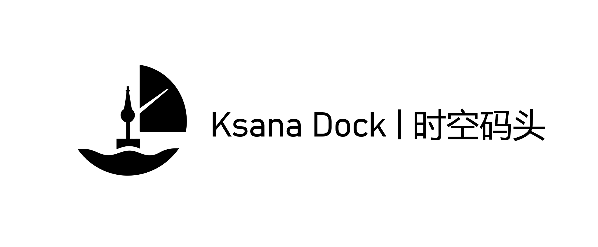

# Microverse

**中文** | [English](README_EN.md)

## 🎮 Steam版本即将上线

<div align="center">


**《Microverse In Box 盒中小世界》即将登陆Steam平台！**

[](https://store.steampowered.com/app/3902630/Microverse_In_Box/)

[🎯 **添加到Steam愿望单**](https://store.steampowered.com/app/3902630/Microverse_In_Box/) | [📖 **查看Steam页面**](https://store.steampowered.com/app/3902630/Microverse_In_Box/)

---

**📝 关于本开源项目**: 本仓库开源的是《Microverse In Box》游戏在2025年6月的初版Demo，为开发者和爱好者提供学习和参考。完整版游戏将在Steam平台发布，包含更多功能、优化和内容。

</div>

---

一个模拟上帝类的沙盒游戏，基于Godot 4开发的多智能体AI社交模拟系统。在这个虚拟世界中，AI角色拥有独立的思维和记忆，能够自主进行社交互动、完成任务，并在持续的交流中发展出复杂的社会关系。

## 📸 项目效果预览

<div align="center">


*办公室场景中的AI角色互动效果*

</div>

## 🌟 项目特色

- **沙盒式AI社会**: 类似斯坦福AI小镇，AI角色在开放世界中自主生活和互动
- **多智能体生态系统**: 支持多个AI角色同时在场景中进行复杂的社会互动
- **智能对话系统**: 基于大语言模型的自然对话，支持多种API提供商
- **持久化记忆系统**: AI角色具备长期记忆能力，能够记住历史对话和事件，形成连续的生活体验
- **自主任务管理**: AI角色可以自主接受、执行和管理各种任务，展现真实的工作生活
- **环境感知能力**: AI角色能够感知周围环境和其他角色的状态，做出相应反应
- **多AI服务集成**: 支持OpenAI、Claude、Gemini、DeepSeek、豆包、Kimi等多种AI服务

## 🎮 沙盒游戏特性

### 🤖 AI角色生态系统
- 8个预设AI角色，每个都有独特的性格、背景故事和行为模式
- 角色可以在虚拟世界中自由移动、探索和互动
- 支持角色状态管理、情绪变化和自主行为决策
- AI角色会根据环境和社交情况做出真实的反应

### 💬 自然社交系统
- 基于大语言模型的自然语言对话，支持多轮深度交流
- 动态对话气泡UI，实时显示角色间的交流
- 完整的对话历史记录和回放功能
- 支持群体讨论、私人对话和随机社交互动

### 🧠 智能记忆与学习
- 持久化长期记忆存储系统
- AI角色能够学习和适应环境变化
- 记忆的格式化存储和智能检索
- 基于记忆的个性化行为发展

### 📋 自主任务生态
- 任务的自动创建、智能分配和实时跟踪
- 基于优先级的任务管理系统
- 任务完成状态的动态监控
- AI角色间的任务协作和竞争机制

## 🛠️ 技术栈

- **游戏引擎**: Godot 4.3+
- **编程语言**: GDScript
- **AI集成**: REST API调用
- **数据存储**: JSON格式本地存储
- **UI框架**: Godot内置UI系统

## 📋 系统要求

### 开发环境
- Godot 4.3或更高版本

### 支持平台
- **Windows**: Windows 10/11 (64位)
- **macOS**: macOS 10.15+ (Intel/Apple Silicon)
- **Linux**: Ubuntu 18.04+, Fedora 32+, Arch Linux等主流发行版
- **Android**: Android 6.0+ (API Level 23+)

### 硬件要求
- **最低配置**: 4GB RAM, 1GB可用存储空间
- **推荐配置**: 8GB RAM, 2GB可用存储空间
- **网络**: 稳定的互联网连接（用于AI API调用）

### 注意事项
- Android平台需要额外的平台特定配置
- 所有平台都需要有效的AI服务API密钥才能正常使用对话功能

## 🚀 快速开始

### 1. 克隆项目
```bash
git clone https://github.com/KsanaDock/Microverse.git
cd microverse
```

### 2. 打开项目
1. 启动Godot编辑器
2. 点击"导入"按钮
3. 选择项目根目录下的`project.godot`文件
4. 点击"导入并编辑"

### 3. 配置API
1. 运行游戏
2. 按ESC键打开设置界面
3. 在API设置中配置你的AI服务提供商和API密钥
4. 支持的服务商：
   - OpenAI (GPT-3.5, GPT-4)
   - Anthropic Claude
   - Google Gemini
   - DeepSeek
   - 字节跳动豆包
   - 月之暗面Kimi
   - Ollama (本地部署)

### 4. 开始游戏
1. 选择地图（目前支持办公室场景）
2. 使用WASD键移动角色
3. 按T键开始与AI角色对话
4. 按L键结束对话
5. 按`键打开控制台

## 🎯 使用说明

### 基本操作
- **移动**: WASD键或方向键
- **坐下**: 空格键
- **开始对话**: T键
- **结束对话**: L键
- **打开设置**: ESC键
- **保存/加载**: F1键
- **控制台**: `键（反引号）

### AI角色介绍
- **Alice**: 友善的项目经理
- **Grace**: 专业的数据分析师
- **Jack**: 创意十足的设计师
- **Joe**: 技术专家
- **Lea**: 市场营销专家
- **Monica**: HR专员
- **Stephen**: 财务分析师
- **Tom**: 软件开发工程师

### 高级功能
- **记忆查看**: 在控制台中查看AI角色的记忆
- **任务管理**: 给AI角色分配和管理任务
- **场景切换**: 支持多个场景地图
- **存档系统**: 保存和加载游戏状态

## 🔧 开发指南

### 项目结构
```
office/
├── asset/          # 游戏资源文件
├── scene/          # 场景文件
├── script/         # 脚本文件
│   ├── ai/         # AI相关脚本
│   └── ui/         # UI相关脚本
└── docs/           # 文档文件
```

### 核心系统
- **APIManager**: API调用管理
- **DialogManager**: 对话系统管理
- **MemoryManager**: 记忆系统管理
- **CharacterManager**: 角色管理
- **TaskManager**: 任务管理

### 扩展开发
- 添加新的AI角色
- 创建新的场景地图
- 集成新的AI服务提供商
- 扩展对话功能

## 🤝 贡献指南

欢迎贡献代码！请遵循以下步骤：

1. Fork本项目
2. 创建特性分支 (`git checkout -b feature/AmazingFeature`)
3. 提交更改 (`git commit -m 'Add some AmazingFeature'`)
4. 推送到分支 (`git push origin feature/AmazingFeature`)
5. 创建Pull Request

## 📝 许可证

本项目采用MIT许可证 - 查看 [LICENSE](LICENSE) 文件了解详情。

## 🙏 致谢

- Godot游戏引擎团队
- 各AI服务提供商
- 开源社区的贡献者们
- 美术素材来源: [LimeZu](https://limezu.itch.io/) - 感谢这位优秀艺术家提供的精美游戏素材

## 📞 联系方式

<div align="center">



</div>

如有问题或建议，请通过以下方式联系：

- 提交Issue: [GitHub Issues](https://github.com/KsanaDock/Microverse/issues)
- 官方网站: [时空码头KsanaDock](https://www.ksanadock.com)

## 🌐 关注我们

<div align="center">

### 在社交媒体上关注我们的最新动态

<table>
<tr>
<td align="center" width="200">
<a href="https://www.xiaohongshu.com/user/profile/653c5f81000000000301f274">

<br/>
<strong>小红书</strong>
<br/>
<sub>创意分享与交流</sub>
</a>
</td>
<td align="center" width="200">
<a href="https://space.bilibili.com/336052319">

<br/>
<strong>哔哩哔哩</strong>
<br/>
<sub>中文视频内容</sub>
</a>
</td>
<td align="center" width="200">
<a href="https://github.com/KsanaDock">

<br/>
<strong>GitHub</strong>
<br/>
<sub>项目源码与更新</sub>
</a>
</td>
</tr>
<tr>
<td align="center" width="200">
<a href="https://x.com/KsanaDock">

<br/>
<strong>X (Twitter)</strong>
<br/>
<sub>最新资讯与讨论</sub>
</a>
</td>
<td align="center" width="200">
<a href="https://store.steampowered.com/app/3902630/Microverse_In_Box/">

<br/>
<strong>Steam</strong>
<br/>
<sub>游戏发布与更新</sub>
</a>
</td>
<td align="center" width="200">
<a href="https://www.youtube.com/@KsanaDock">

<br/>
<strong>YouTube</strong>
<br/>
<sub>演示视频与教程</sub>
</a>
</td>
</tr>
</table>

</div>

---

**注意**: 使用本项目需要有效的AI服务API密钥。请确保遵守各AI服务提供商的使用条款和条件。