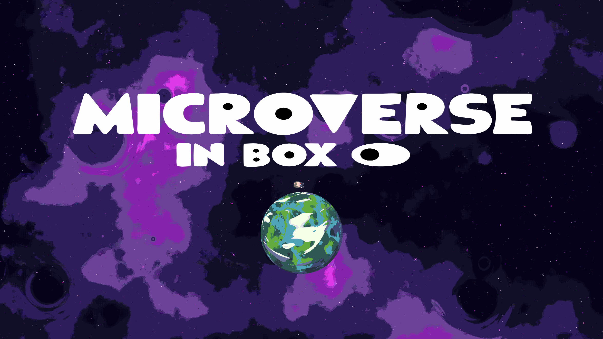

# Microverse

[中文](README.md) | **English**

## 🎮 Coming Soon to Steam

<div align="center">



**Microverse In Box is coming to Steam!**

[](https://store.steampowered.com/app/3902630/Microverse_In_Box/)

[🎯 **Add to Steam Wishlist**](https://store.steampowered.com/app/3902630/Microverse_In_Box/) | [📖 **View Steam Page**](https://store.steampowered.com/app/3902630/Microverse_In_Box/)

---

**📝 About This Open Source Project**: This repository contains the open-source version of the initial demo of "Microverse In Box" from June 2025, provided for developers and enthusiasts to learn and reference. The complete version will be released on Steam with more features, optimizations, and content.

</div>

---

A god-simulation sandbox game built on Godot 4 as a multi-agent AI social simulation system. In this virtual world, AI characters possess independent thinking and memory, capable of autonomous social interactions, task completion, and developing complex social relationships through continuous communication.

## 📸 Project Preview

<div align="center">


*AI character interactions in the office scene*

</div>

## 🌟 Key Features

- **Sandbox AI Society**: Similar to Stanford AI Town, AI characters live and interact autonomously in an open world
- **Multi-Agent Ecosystem**: Supports multiple AI characters engaging in complex social interactions simultaneously
- **Intelligent Dialogue System**: Natural conversations powered by large language models, supporting multiple API providers
- **Persistent Memory System**: AI characters have long-term memory capabilities, remembering historical conversations and events to form continuous life experiences
- **Autonomous Task Management**: AI characters can autonomously accept, execute, and manage various tasks, demonstrating realistic work-life scenarios
- **Environmental Awareness**: AI characters can perceive their surroundings and other characters' states, responding accordingly
- **Multi-AI Service Integration**: Supports OpenAI, Claude, Gemini, DeepSeek, Doubao, Kimi, and other AI services

## 🎮 Sandbox Game Features

### 🤖 AI Character Ecosystem
- 8 preset AI characters, each with unique personalities, backstories, and behavioral patterns
- Characters can freely move, explore, and interact within the virtual world
- Supports character state management, emotional changes, and autonomous behavioral decisions
- AI characters respond realistically based on environmental and social situations

### 💬 Natural Social System
- Natural language conversations powered by large language models, supporting multi-turn deep exchanges
- Dynamic dialogue bubble UI displaying real-time character interactions
- Complete dialogue history recording and playback functionality
- Supports group discussions, private conversations, and random social interactions

### 🧠 Intelligent Memory & Learning
- Persistent long-term memory storage system
- AI characters can learn and adapt to environmental changes
- Formatted memory storage and intelligent retrieval
- Personalized behavioral development based on memory

### 📋 Autonomous Task Ecosystem
- Automatic task creation, intelligent assignment, and real-time tracking
- Priority-based task management system
- Dynamic monitoring of task completion status
- Task collaboration and competition mechanisms between AI characters

## 🛠️ Technology Stack

- **Game Engine**: Godot 4.3+
- **Programming Language**: GDScript
- **AI Integration**: REST API calls
- **Data Storage**: JSON format local storage
- **UI Framework**: Godot built-in UI system

## 📋 System Requirements

### Development Environment
- Godot 4.3 or higher

### Supported Platforms
- **Windows**: Windows 10/11 (64-bit)
- **macOS**: macOS 10.15+ (Intel/Apple Silicon)
- **Linux**: Ubuntu 18.04+, Fedora 32+, Arch Linux and other major distributions
- **Android**: Android 6.0+ (API Level 23+)

### Hardware Requirements
- **Minimum**: 4GB RAM, 1GB available storage
- **Recommended**: 8GB RAM, 2GB available storage
- **Network**: Stable internet connection (for AI API calls)

### Important Notes
- Android platform requires additional platform-specific configuration
- All platforms require valid AI service API keys for dialogue functionality

## 🚀 Quick Start

### Installation

1. **Clone the repository**
   ```bash
   git clone https://github.com/KsanaDock/Microverse.git
   cd microverse
   ```

2. **Open with Godot**
   - Download and install Godot 4.3+
   - Open Godot Engine
   - Click "Import" and select the `project.godot` file
   - Click "Import & Edit"

### API Configuration

1. **Open Settings**
   - Launch the game
   - Press `Tab` to open the settings panel
   - Navigate to the "API Settings" tab

2. **Configure API Provider**
   - Choose your preferred AI service provider:
     - **OpenAI**: Requires OpenAI API key
     - **Claude**: Requires Anthropic API key
     - **Gemini**: Requires Google AI API key
     - **DeepSeek**: Requires DeepSeek API key
     - **Doubao**: Requires ByteDance API key
     - **Kimi**: Requires Moonshot API key

3. **Enter API Key**
   - Input your API key in the corresponding field
   - Select the model you want to use
   - Click "Save Settings"

### Basic Usage

1. **Start the Game**
   - Click "Start Game" on the main menu
   - Select a map (currently supports Office scene)

2. **Interact with AI Characters**
   - Click on any AI character to start a conversation
   - Type your message and press Enter
   - Watch AI characters interact with each other autonomously

3. **Observe AI Behavior**
   - AI characters will move around the scene automatically
   - They engage in conversations with each other
   - Characters remember previous interactions and develop relationships

## 🎭 AI Characters

The game features 8 unique AI characters, each with distinct personalities:

- **Alice**: Creative and artistic, loves discussing art and literature
- **Grace**: Analytical and logical, excels at problem-solving
- **Jack**: Outgoing and social, enjoys meeting new people
- **Joe**: Technical and detail-oriented, passionate about technology
- **Lea**: Empathetic and caring, great at providing emotional support
- **Monica**: Organized and efficient, excellent at project management
- **Stephen**: Intellectual and philosophical, enjoys deep conversations
- **Tom**: Humorous and relaxed, brings joy to social interactions

## 🔧 Advanced Features

### Memory System
- **Long-term Memory**: Characters remember conversations and events across sessions
- **Contextual Recall**: AI can reference past interactions in current conversations
- **Relationship Development**: Characters build and maintain relationships over time

### Task Management
- **Dynamic Task Creation**: Tasks are generated based on character interactions and needs
- **Priority System**: Tasks are prioritized based on urgency and importance
- **Collaborative Tasks**: Characters can work together on complex tasks

### Scene Perception
- **Environmental Awareness**: Characters understand their physical surroundings
- **Social Awareness**: Characters recognize and respond to other characters' presence
- **State Management**: Characters maintain internal states affecting their behavior

## 🛠️ Development

### Project Structure
```
microverse/
├── asset/          # Game assets (sprites, UI, etc.)
├── scene/          # Godot scene files
├── script/         # GDScript source code
├── docs/           # Documentation
└── README.md       # This file
```

### Key Components
- **AIAgent**: Core AI character logic
- **DialogManager**: Handles conversation flow
- **MemorySystem**: Manages character memory
- **TaskManager**: Coordinates task execution
- **APIManager**: Handles AI service integration

### Building from Source
1. Ensure you have Godot 4.3+ installed
2. Clone the repository
3. Open the project in Godot
4. Configure your API keys
5. Run the project (F5)

## 🤝 Contributing

We welcome contributions! Please see our [Contributing Guidelines](CONTRIBUTING.md) for details on:

- Reporting bugs
- Suggesting features
- Submitting pull requests
- Code style guidelines

### Areas for Contribution
- New AI character personalities
- Additional map/scene designs
- UI/UX improvements
- Performance optimizations
- Documentation improvements
- Localization support

## 📄 License

This project is licensed under the MIT License - see the [LICENSE](LICENSE) file for details.

## 🙏 Acknowledgments

- Inspired by Stanford AI Town research project
- Built with Godot Engine
- Powered by various AI service providers
- Thanks to the open-source community
- Art Assets: [LimeZu](https://limezu.itch.io/) - Special thanks to this talented artist for providing beautiful game assets

## 📞 Contact

<div align="center">


</div>

- **Issues**: [GitHub Issues](https://github.com/KsanaDock/Microverse/issues)
- **Official Website**: [KsanaDock](https://www.ksanadock.com)

## 🌐 Follow Us

<div align="center">

### Stay updated with our latest developments on social media

<table>
<tr>
<td align="center" width="200">
<a href="https://www.xiaohongshu.com/user/profile/653c5f81000000000301f274">

<br/>
<strong>Xiaohongshu</strong>
<br/>
<sub>Creative Sharing & Community</sub>
</a>
</td>
<td align="center" width="200">
<a href="https://space.bilibili.com/336052319">

<br/>
<strong>Bilibili</strong>
<br/>
<sub>Chinese Video Content</sub>
</a>
</td>
<td align="center" width="200">
<a href="https://github.com/KsanaDock">

<br/>
<strong>GitHub</strong>
<br/>
<sub>Source Code & Updates</sub>
</a>
</td>
</tr>
<tr>
<td align="center" width="200">
<a href="https://x.com/KsanaDock">

<br/>
<strong>X (Twitter)</strong>
<br/>
<sub>Latest News & Discussion</sub>
</a>
</td>
<td align="center" width="200">
<a href="https://store.steampowered.com/app/3902630/Microverse_In_Box/">

<br/>
<strong>Steam</strong>
<br/>
<sub>Game Releases & Updates</sub>
</a>
</td>
<td align="center" width="200">
<a href="https://www.youtube.com/@KsanaDock">

<br/>
<strong>YouTube</strong>
<br/>
<sub>Demo Videos & Tutorials</sub>
</a>
</td>
</tr>
</table>

</div>

---

**Microverse** - Where AI characters come to life in a sandbox social simulation! 🌟